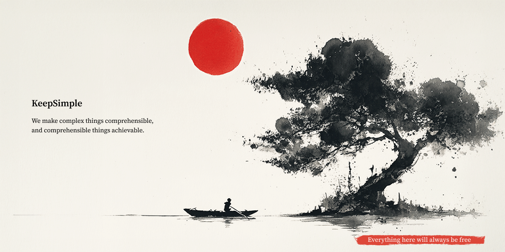

 

KeepSimple was founded in 2019 by Wolf Alexanyan as a free, public initiative exploring the intersection of management, IT, and cognitive science. Since then, it has grown into a recognized open-source hub for practical frameworks, educational tools, and experiments in applied behavioral science. Today, KeepSimple hosts several major modules, including:

🎆[UX Core](https://keepsimple.io/uxcore) - A first-of-its-kind free educational tool, UX Core quickly spread through global product management communities after its release in 2020. Contains 1,000+ practical examples of cognitive biases applied to product design, software development, and team management. Widely recognized by leading scholars in cognitive science and behavioral economics (Duke University, Harvard Business School, AUD, and others). Actively used by managers, designers, and educators worldwide.

🎆[Company Management aka Pyramids](https://keepsimple.io/company-management) - A modular management framework built for remote-first software development companies. Originally designed for Wolf's own startup - The Software Development Company - it became the first public attempt in the region to open-source its internal structure and processes at this level of detail.

🎆[Articles](https://keepsimple.io/articles) - A collection of original articles exploring cognitive science, product management, and project management.

## 🛠 Tech stack

### The project is built using:

- React (via Next.js)

- TypeScript

- SCSS modules

- Node.js version: 20.19.0 (see `.nvmrc`)

### Additional tooling:

- ESLint – for consistent code quality

- Prettier – for automatic code formatting

- Husky – used to `run npx lint-staged` on pre-commit

  ***

## ⚙️ Install dependencies:

In this project we use Yarn, so make sure you have it installed.

```bash
yarn install
```

### Run the app locally:

```bash
yarn dev
```

**App runs at http://localhost:3005**

---

## ✍️ Commit Rules & Branch Naming

We use <a href="https://www.conventionalcommits.org/en/v1.0.0/">Conventional Commits</a> to keep our history clean and readable.

Commit prefixes and branch names should be in the following format:

- `feat:` - ✨ A new feature
- `hotfix:` - 🚑 A critical fix
- `docs:` - 📝 Documentation only changes
- `style:` - 💅 Changes that do not affect the meaning of the code (white-space, formatting, missing semi-colons, etc)
- `refactor:` - 🔨 A code change that neither fixes a bug nor adds a feature
- `chore:` - 👷Dev setup, tooling, config or just some random task
- `bugfix:` - 🐛 A bug fix

Example commit message:

```
feat: added new button component
```

### 🌿 Branch Naming Rules

There are **two ways** of creating a branch:

| Case                                          | Rule                                                                              | Example                                                                                  |
| --------------------------------------------- | --------------------------------------------------------------------------------- | ---------------------------------------------------------------------------------------- |
| **From an Issue (preferred if Issue exists)** | GitHub auto-adds the Issue number. **Always use this when related Issue exists.** | `feat/123-add-new-button-component`                                                      |
| **Without an Issue**                          | Use standard format with type/purpose.                                            | `feat/add-new-button-component`<br>`hotfix/fix-login-crash`<br>`bugfix/button-alignment` |

---

## 📝Folder Structure and Naming Conventions

- tests - contains all the Playwright e2e tests, organized by priority tier (`tests/p0/`, `tests/p1/`, `tests/p2/`) with shared `tests/fixtures/` and `tests/helpers/`. Run with `yarn test:e2e` (or `:p0` / `:p1` / `:p2` for a single tier).
- public - contains static assets like images, icons, etc.
- src - contains the main application code
  - api - contains API requests and related code
  - data - contains static data in Russian, English and Armenian languages
  - assets - contains static assets like images, icons, etc.
  - components - reusable components
  - hooks - custom React hooks
  - layouts - layout components
  - lib - utility functions and libraries
  - local-types - local shareable types used in the project
  - pages - Next.js pages
  - styles - global styles and variables

---

## 📦 Import Order Guidelines

To keep the project structure consistent, please follow this import order in files:

- Third-party libraries (e.g., React, Next.js, lodash)

- Global styles (/src/styles)

- Constants (/src/constants)

- Helpers (/src/helpers)

- Types (/src/types)

- Hooks (/src/hooks)

- Lib (/src/lib)

- Api (/src/api)

- Components (/src/components)

- Layouts (/src/layouts)

- Features (/src/features)

- Assets (/public/images, SVGs, icons) - \*But in general we will be using Icon component

- Local styles

---

## ⚙️ Component Files

```
Each Component have its own folder with the following structure:
src/components/ComponentName/
src/components/ComponentName/index.tsx
src/components/ComponentName/ComponentName.tsx
src/components/ComponentName/ComponentName.module.scss
src/components/ComponentName/ComponentName.types.ts

Same approach applies to Layouts.
```

<p align="left">
  <strong style="font-size: 13px; vertical-align: middle;"> ❗️Some components don't have separate types, instead types are defined directly in the component file.
That's an old approach, but we will be moving to the new one gradually.</strong>
</p>

---

Thank you for reading! Be Kind. Do Good. 🍃
